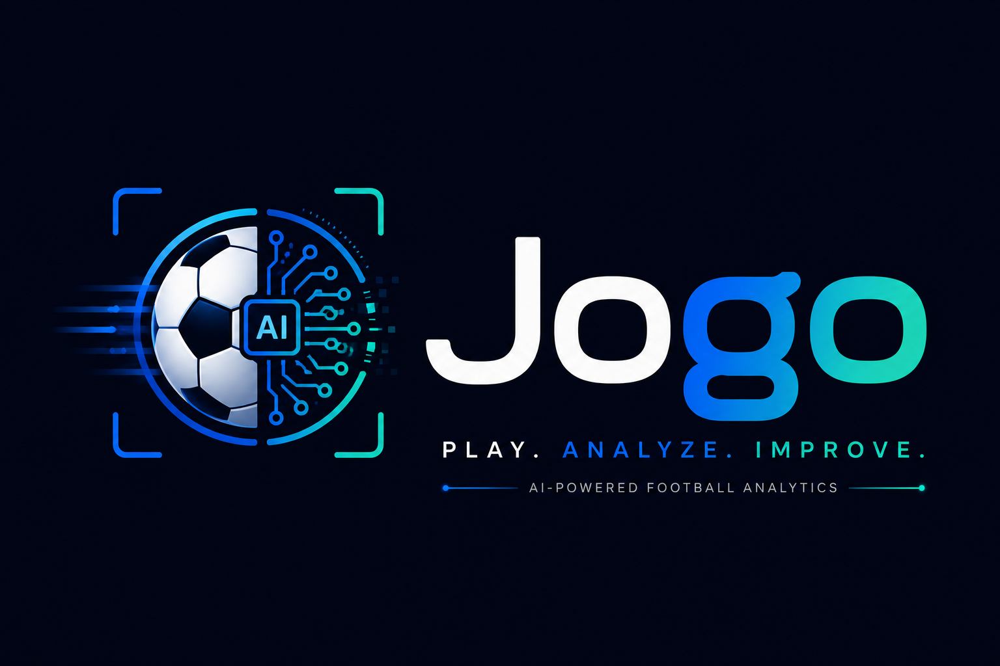

  

  <strong>AI-Powered Football Performance Analysis & Talent Discovery Platform</strong>

  Turning football videos into actionable performance insights and professional opportunities.

---

🚀 Overview

Jogo is an AI-powered football performance analysis and talent discovery platform designed to connect grassroots football players with clubs, academies, and scouts.

Jogo analyzes uploaded football videos using Computer Vision and AI to extract performance indicators, generate reports, identify strengths and weaknesses, and provide personalized development recommendations.

At the same time, clubs and scouts can discover players through searchable performance data instead of relying only on traditional scouting methods.

---

🎯 The Problem

Thousands of talented football players struggle to reach professional opportunities because traditional talent discovery often depends on:

- Personal connections
- Coach recommendations
- Local scouting networks
- Manual video analysis
- Limited access to professional scouts
- Subjective player evaluation

This creates a gap between football talent and professional opportunities.

Our Goal

Make football talent discovery more:

Accessible → Data-driven → Objective → Scalable

---

💡 Our Solution

Jogo creates a digital football ecosystem where players can upload their performances and receive AI-powered analysis.

The platform transforms:

Football Video
      ↓
Computer Vision
      ↓
Player & Ball Detection
      ↓
Tracking
      ↓
Football Event Detection
      ↓
Performance Metrics
      ↓
AI Performance Report
      ↓
Player Development
      ↓
Talent Discovery

---

✨ Key Features

👤 Player Platform

Players can:

- Create and manage their football profile
- Upload football videos
- Request AI analysis
- View performance reports
- Track historical performance
- Review strengths and weaknesses
- Receive personalized recommendations
- Upload a profile image
- Manage scout contact requests

---

🔍 Talent Discovery

Clubs and scouts can discover players using performance-based filters.

Available filters include:

- Age
- Position
- Country
- Overall performance score
- Performance range

This allows scouts to move from:

«"Who do I know?"»

to:

«"Who actually matches the requirements?"»

---

🧑‍💼 Scout Platform

Scouts can:

- Search for players
- View player profiles
- Review performance data
- Review AI-generated reports
- Send contact requests
- Manage recruitment opportunities

Players can then accept or reject scout contact requests.

---

🤖 AI Football Analysis

Jogo includes a dedicated Python-based Computer Vision service for football performance analysis.

Analysis Pipeline

Video
  │
  ▼
Video Inspection
  │
  ├── Duration
  ├── FPS
  ├── Resolution
  ├── Camera Movement
  ├── Ball Visibility
  └── Player Visibility
  │
  ▼
Player & Ball Detection
  │
  ▼
Player / Ball Tracking
  │
  ▼
Football Event Detection
  │
  ├── Possession
  ├── Reception
  ├── Pass
  ├── Dribble
  ├── Shot
  └── Ball Loss
  │
  ▼
Performance Metrics
  │
  ▼
Overall Score
  │
  ▼
Strengths & Weaknesses
  │
  ▼
Training Recommendations

Current AI Metrics

Depending on the available evidence in the video, the system can evaluate metrics such as:

- Passing accuracy
- Ball control
- Movement efficiency
- Attacking performance
- Defensive performance
- Decision-making indicators
- Overall performance score

The system uses evidence thresholds and confidence values rather than generating unsupported scores.

For example, if the video does not contain enough players or enough reliable ball events, a metric can be returned as unavailable instead of producing a misleading score.

---

🧠 Computer Vision

The current MVP uses classical Computer Vision techniques that can run without large pretrained ML dependencies.

Current Detection

- Player Detection: OpenCV HOG pedestrian detector
- Ball Detection: Hough Circle-based detection
- Player Tracking: IoU-based tracking
- Ball Tracking: Nearest-neighbor tracking with speed constraints
- Event Detection: Geometric and temporal heuristics

The architecture is intentionally modular so that the detection layer can later be replaced with stronger football-specific models such as:

- YOLO
- Pose Estimation
- Football-specific object detection models
- Advanced multi-object tracking

without rewriting the downstream analysis pipeline.

---

🏗️ System Architecture

Jogo is built as a distributed full-stack system.

                        ┌──────────────────────┐
                        │      Frontend        │
                        │ React + TypeScript   │
                        └──────────┬───────────┘
                                   │
                                   ▼
                        ┌──────────────────────┐
                        │    Jogo REST API     │
                        │    ASP.NET Core      │
                        └──────────┬───────────┘
                                   │
             ┌─────────────────────┼─────────────────────┐
             │                     │                     │
             ▼                     ▼                     ▼
      ┌─────────────┐      ┌──────────────┐      ┌─────────────┐
      │ SQL Server  │      │  AI Service  │      │    Seq      │
      │             │      │ Python/FastAPI│      │   Logging   │
      └─────────────┘      └──────────────┘      └─────────────┘
                                   │
                                   ▼
                         Football Video Analysis

---

🛠️ Technology Stack

Backend

- C#
- .NET 10
- ASP.NET Core Web API
- Entity Framework Core
- MediatR
- FluentValidation
- JWT Authentication
- ASP.NET Core Identity
- Hangfire
- Serilog
- OpenTelemetry
- Swagger / OpenAPI
- Scalar

Database

- Microsoft SQL Server
- Entity Framework Core
- Code First
- Migrations

AI / Computer Vision

- Python
- FastAPI
- OpenCV
- NumPy
- SciPy

Frontend

- React
- TypeScript
- Vite
- Tailwind CSS
- React Router
- Axios
- Lucide React

Infrastructure

- Docker
- Docker Compose
- SQL Server Container
- Python AI Container
- Seq Logging
- REST APIs

---

🏛️ Backend Architecture

The ASP.NET Core backend follows a layered architecture:

Jogo.Api
    │
    ▼
Jogo.Application
    │
    ▼
Jogo.Domain
    ▲
    │
Jogo.Infrastructure

Projects

BE/Jogo
│
├── src
│   ├── Jogo.Api
│   ├── Jogo.Application
│   ├── Jogo.Domain
│   └── Jogo.Infrastructure
│
└── tests
    ├── Jogo.Api.IntegrationTests
    ├── Jogo.Application.UnitTests
    └── Jogo.Domain.UnitTests

---

📦 Backend Layers

Jogo.Api

Responsible for:

- HTTP endpoints
- Controllers
- Authentication configuration
- Middleware
- OpenAPI / Swagger
- API versioning
- Exception handling
- Request logging

Jogo.Application

Contains the application business logic:

- Commands
- Queries
- DTOs
- Validators
- Behaviors
- Application interfaces
- AI integration contracts

The project uses MediatR to separate API requests from application logic.

Jogo.Domain

Contains the core business model:

- Entities
- Enums
- Domain rules
- Domain-level abstractions

Jogo.Infrastructure

Responsible for external implementations:

- Entity Framework Core
- SQL Server
- Identity
- JWT
- Database configuration
- File storage
- AI service integration
- Caching
- Hangfire
- Logging

---

🔐 Authentication & Authorization

Jogo uses JWT-based authentication with role-based authorization.

Supported Roles

- "Player"
- "Scout"

Examples:

Player
 ├── Manage Profile
 ├── Upload Videos
 ├── Request Analysis
 ├── View Reports
 └── Respond to Scout Requests

Scout
 ├── Discover Players
 ├── View Player Profiles
 └── Send Contact Requests

---

🔌 Main API Modules

The backend exposes versioned REST endpoints.

Authentication

POST /api/v1/auth/login
POST /api/v1/auth/register/player
POST /api/v1/auth/register/scout
POST /api/v1/auth/refresh
POST /api/v1/auth/logout

Player

GET  /api/v1/player/me
PUT  /api/v1/player/me
POST /api/v1/player/profile/image

Videos

POST   /api/v1/videos
GET    /api/v1/videos
GET    /api/v1/videos/{id}
DELETE /api/v1/videos/{id}

POST /api/v1/videos/{id}/analysis
POST /api/v1/videos/{id}/analysis/retry

Reports

GET /api/v1/reports
GET /api/v1/reports/{id}

Player Discovery

GET /api/v1/players
GET /api/v1/players/{id}

Supported discovery filters include:

Age
Position
Country
Overall Score

Scout

GET /api/v1/scout/me
PUT /api/v1/scout/me

Contact Requests

POST /api/v1/contact-requests
POST /api/v1/contact-requests/{id}/respond

GET /api/v1/contact-requests/player
GET /api/v1/contact-requests/scout

---

🤖 AI Service API

The AI service is implemented using FastAPI.

Health Check

GET /health

Analyze Uploaded Video

POST /analyze/football-performance

Analyze Video From Backend URL

POST /analyze-by-url

Request:

{
  "video_url": "http://jogo-api:8080/uploads/videos/example.mp4"
}

Retrieve Analysis

GET /analysis/{analysis_id}

---

🔄 Video Analysis Flow

Player
   │
   │ Upload Video
   ▼
Jogo API
   │
   │ Store Video
   ▼
Request Analysis
   │
   ▼
AI Service
   │
   ├── Download Video
   ├── Inspect Video
   ├── Detect Players
   ├── Detect Ball
   ├── Track Objects
   ├── Detect Football Events
   └── Calculate Metrics
   │
   ▼
Performance Report
   │
   ▼
Jogo API
   │
   ▼
Player Dashboard

---

📊 Performance Report

The AI generates a structured performance report containing:

- Video information
- Detected events
- Performance metrics
- Metric confidence
- Evidence used for scoring
- Overall score
- Strengths
- Weaknesses
- Training recommendations

The system intentionally avoids calculating metrics when the video does not provide enough reliable evidence.

---

🐳 Running With Docker

The repository includes a complete Docker Compose environment.

Services

jogo-api
jogo-ai
sqlserver
seq

Start the platform

docker compose up --build

Or run in background:

docker compose up --build -d

Stop services

docker compose down

View backend logs

docker compose logs -f jogo-api

---

🌐 Default Services

Service| URL
Jogo API| "http://localhost:5001"
AI Service| "http://localhost:8000"
AI Swagger| "http://localhost:8000/docs"
Seq| "http://localhost:8081"
SQL Server| "localhost:1434"

During development, the ASP.NET Core API also exposes OpenAPI/Swagger and Scalar documentation.

---

💻 Local Development

Backend

Requirements:

- .NET 10 SDK
- SQL Server

Navigate to:

cd BE/Jogo

Restore dependencies:

dotnet restore

Run the API:

dotnet run --project src/Jogo.Api

---

AI Service

Requirements:

- Python 3.11+

Navigate to:

cd football_performance_analysis

Install dependencies:

pip install -r requirements.txt

Run:

uvicorn api:app --reload

The API will be available at:

http://localhost:8000

---

Frontend

Navigate to:

cd Frontend

Install dependencies:

npm install

Run development server:

npm run dev

Build production version:

npm run build

---

🧪 Testing

The backend contains multiple testing projects:

Jogo.Api.IntegrationTests
Jogo.Application.UnitTests
Jogo.Domain.UnitTests

The project uses:

- xUnit
- FluentAssertions
- Moq
- NSubstitute
- Testcontainers
- Coverlet

Run all tests:

dotnet test

---

📂 Repository Structure

Jogo
│
├── Assets
│   └── Logo.png
│
├── BE
│   └── Jogo
│       ├── src
│       │   ├── Jogo.Api
│       │   ├── Jogo.Application
│       │   ├── Jogo.Domain
│       │   └── Jogo.Infrastructure
│       │
│       └── tests
│           ├── Jogo.Api.IntegrationTests
│           ├── Jogo.Application.UnitTests
│           └── Jogo.Domain.UnitTests
│
├── Frontend
│   └── React + TypeScript Application
│
├── football_performance_analysis
│   ├── core
│   ├── api.py
│   ├── cli.py
│   ├── requirements.txt
│   └── tests
│
├── jogo-ai-chatbot
│   ├── app
│   └── tests
│
├── Business
├── Research
├── Technical
├── Documentation
│
└── docker-compose.yml

---

🤝 AI Chatbot

Jogo also includes an AI football assistant designed to provide personalized answers based on a player's performance data.

The chatbot architecture separates:

Player
   ↓
Chat API
   ↓
Chatbot Service
   ↓
Player Data Provider
   ↓
Player Context
   ↓
LLM Service
   ↓
Personalized Response

The architecture uses interfaces so the mock player data provider can later be replaced by the real Jogo backend without changing the chatbot core.

---

🔮 Future Development

The current version represents an MVP foundation.

Future improvements include:

AI

- YOLO-based football detection
- Pose estimation
- Advanced multi-player tracking
- Pitch calibration
- Tactical positioning analysis
- Player speed estimation
- Acceleration analysis
- Full-match analysis
- Advanced tactical intelligence

Platform

- Club accounts
- Academy management
- Advanced scout dashboards
- Player comparison
- Player ranking
- Advanced recruitment tools
- Subscription plans
- Token-based AI analysis
- Notifications
- Cloud video storage

Infrastructure

- Redis-based caching
- Distributed background processing
- Cloud deployment
- Object storage
- Production monitoring
- Scalable AI workers

---

⚠️ Current MVP Limitations

The current AI engine is a baseline Computer Vision implementation.

Because football analysis requires strong visual context, some metrics are only generated when enough evidence is available.

For example:

- Positioning is not scored without reliable pitch calibration.
- Passing accuracy requires multiple detected players.
- Ball-control metrics require sufficient possession events.
- High camera movement can prevent reliable movement analysis.

This approach is intentional:

«Jogo prefers returning "not enough evidence" over generating an inaccurate performance score.»

The modular architecture allows stronger AI models to replace the current detection layer in future versions.

---

🏆 Competition

Jogo was developed as part of the RedDev Competition, combining:

- Software Engineering
- Artificial Intelligence
- Computer Vision
- Football Analytics
- Product Design
- Talent Discovery

The project aims to demonstrate how AI can make football analysis and talent discovery more accessible to players who may not have access to traditional scouting networks.

---

👥 Team

Jogo Team — RedDev Competition

---

📜 License

This project was developed for educational and competition purposes.

---

  <strong>⚽ Jogo — Discover Talent. Measure Performance. Build Opportunities.</strong>

